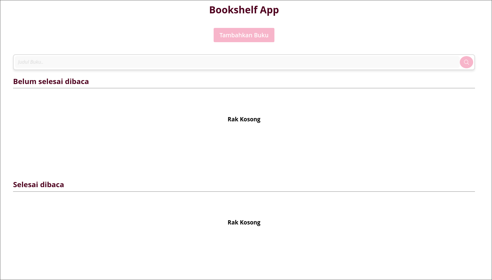
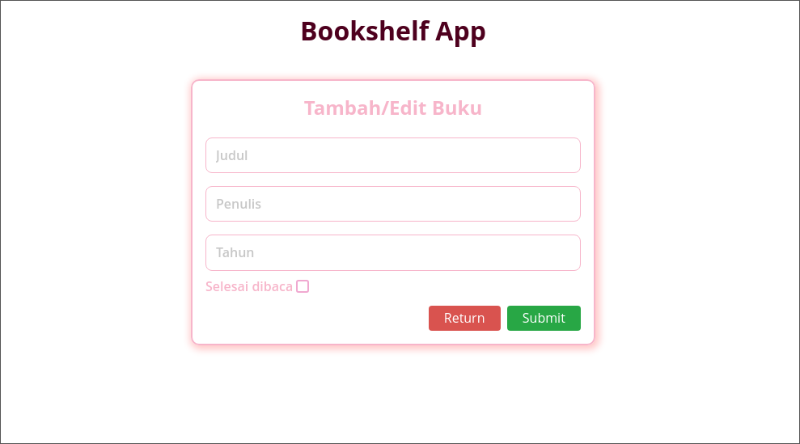

# Final Project - Belajar Membuat Front-End Web untuk Pemula: Bookshelf App

Proyek ini adalah bagian dari tugas akhir dalam program "Belajar Membuat Front-End Web untuk Pemula" di Dicoding. Bookshelf App adalah aplikasi sederhana yang memungkinkan pengguna untuk mengelola koleksi buku mereka secara efisien. Aplikasi ini menyimpan data buku menggunakan localStorage, sehingga semua perubahan tetap tersimpan meskipun halaman dimuat ulang.

Pengguna dapat menambahkan buku, memindahkannya antara dua rak (sudah dibaca dan belum dibaca), mengedit detail buku, serta menghapus buku dari daftar. Aplikasi ini juga menyediakan fitur pencarian untuk memudahkan pengguna menemukan buku yang diinginkan. Semua fitur dirancang dengan tampilan yang rapi dan responsif.

## Kriteria

-   [x] Gunakan localStorage sebagai Penyimpanan
-   [x] Mampu Menambahkan Buku
-   [x] Memiliki Dua Rak Buku
-   [x] Dapat Memindahkan Buku Antar Rak
-   [x] Dapat Menghapus Data Buku
-   [x] Menambahkan Fitur Pencarian Buku
-   [x] Menambahkan Fitur Edit Buku
-   [x] Kode Ditulis Secara Rapi dan Bersih
-   [x] Menerapkan Styling

## Screenshots

